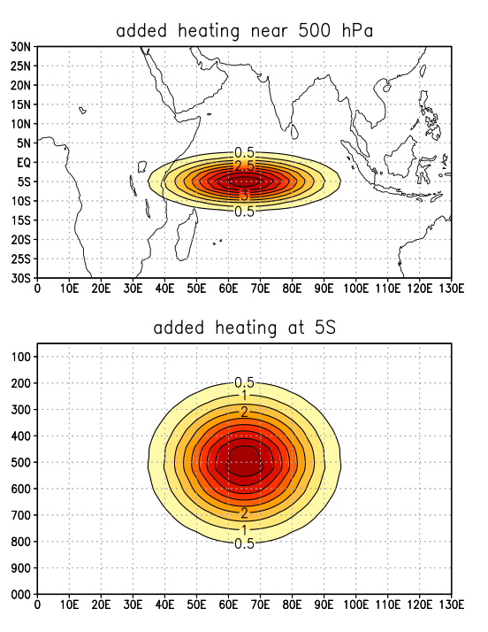

## Added Heating

The version of CESM that we are using (CESM 2.1.1) has code and a namelist configuration in the atmosphere that performs atmospheric nudging (also sometimes called relaxation) for zonal wind (U), meridional wind (V), temperature (T), specific humidity (Q), and pressure (PS).  We will setup an experiment to add a constant, idealized nudging to temperature (T).

Remember, source code is located in:

`/glade/work/USERNAME/cesm2.1.1/components/`

The source code for nudging in the atmosphere is located in the `cam` physics subroutines.  

Let's take a look:

~~~
$ cd /glade/work/USERNAME/cesm2.1.1/components/cam/src/physics/cam/
~~~
{: .language-bash}

The subroutines are in the file `nudging.F90` and they are called by `physpkg.F90`.  

~~~
vi nudging.F90
~~~
{: .language-bash}

~~~
...

Nudging tendencies are applied as a relaxation force between the current
model state values and target state values derived from the avalilable
analyses. The form of the target values is selected by the 'Nudge_Force_Opt'
option, the timescale of the forcing is determined from the given
'Nudge_TimeScale_Opt', and the nudging strength Alpha=[0.,1.] for each
variable is specified by the 'Nudge_Xcoef' values. Where X={U,V,T,Q,PS}

F_nudge = Alpha*((Target-Model(t_curr))/TimeScale

...

~~~
{: .output}

What this means is that the nudging functions apply a contstraint that gently pushes the model towards a particular state of U,V,T,Q, or PS over some timescale.  Using the `cam` namelist, you can control how gentle or not gentle that push is and what it is pushed towards. 

This nudging is preferrable to all the sudden imposing something in the model because it allows the model to adjust without responding in an unphysical way or `blowing up` and crashing due to an unrealistic instability. Models don't like sudden big changes.

We will use this nudging functionality in the model to add a constant 3D heating to the T variable.  We will need to change the `nudging.F90` source code for this experiment.

### Let's create and setup our case

Remember to first go to your `/glade/work/USERNAME/cesm2.1.1/cime/scripts/` directory to run `create_newcase`.

~~~
$ ./create_newcase --case ~/cases/addheat --res f19_g17 --compset B1850 --project UGMU0032
$ cd ~/cases/addheat
$ ./case.setup
~~~
{: .language-bash}

### Step 1: Modify the Source Code

Now we need to modify the nudging source code so that it will add a constant heating to T.

> ## Modifying source code
> 
> Where do we put source code modifications for our case?
>
> 
> a) user_nl_cam
>
> b) /glade/scratch/USERNAME/CASE/run
>
> c) $CASEROOT
>
> d) $CASEROOT/SourceMods/src.cam 
>
>> ## Solution
>>
>> a) not correct. this is where namelist changes go
>>
>> b) not correct. this is the run directory for your case.  we don't make changes here.
>>
>> c) not correct. 
>>
>> d) Correct! We will copy a new `nudging.F90` file to our `SourceMods/src.cam` directory to make changes.
>> 
> {: .solution}
{: .challenge}

We are going to use a new `nudging.F90` file created by Dr. Swenson which has the code changes for applying an constant added heating to the atmospheric model. 

Copy Dr. Swenson's file: `/glade/u/home/swenson/run_CESM2.1.1/SourceMods/nudging.F90-ADDCONST` to our `SourceMods/src.cam` directory. Call the new file `nudging.F90`

~~~
$ cp /glade/u/home/swenson/run_CESM2.1.1/SourceMods/nudging.F90-ADDCONST ./SourceMods/src.cam/nudging.F90
~~~
{: .language-bash}

To see how this nudging.F90 code is different than the origingal, use `diff` command.

~~~
diff SourceMods/src.cam/nudging.F90 /glade/work/kpegion/cesm2.1.1/components/cam/src/physics/cam/nudging.F90 | more
~~~
{: .language-bash}

Need to explain differences.

## Step 2: Modify the namelist

We need to modify our output and output frequency and some of the namelist parameters associated with the added heating configuration.  These are modified in the namelist `user_nl_cam`.

#### Modify output and output frequency:

`avgflag_pertape = ‘A’,‘I’,‘I’`

`nhtfrq = 0,-24,-6`

`mfilt = 1,1,1`

`fincl2 = ‘U’,‘V’,‘OMEGA’,‘Z3’,‘T’,‘Q’,‘PRECT’,‘FLUT’,‘TMQ’,‘PS’,‘PHIS’`

`fincl3 = ‘DTCOND’,‘QRS’,‘QRL’,‘DTV’,‘Nudge_T’,‘PS’,‘PHIS’`

> ## Output Frequency
> 
> What does `nhtfrq=0.-24,-6` mean?
>
> What does `mfilt=1,1,1` mean?
>
> What do `fincl2` and `fincl3` specify?
>
> `avgflag_pertape = ‘A’,‘I’,‘I’` indicates how to average for each of the history files. 
>
>  `A`=average value over the `nhtfrq`
>
>  `I`=instantaneous value at the `nhtfrq`
>
{: .challenge}

#### Modify the `nudging` namelist configuration

These namelist changes apply added heating, set the forcing directory, and the file template.
Heating is applied 4 times per day.  
If CESM is initialized on 0005-01-01, then the first and only forcing file read is addheat.0005-01-01-21600.nc

`Nudge_Model = .true.`

`Nudge_Path = ‘/glade/scratch/swenson/archive/forcing/`

`Nudge_File_Template = ‘addheat.%y-%m-%d-%s.nc`

`Nudge_Times_Per_Day=4`

`Model_Times_Per_Day=48`

These namelist changes apply a tendency to temperture over a specified domain.
We do not change the other variables (U,V,Q,PS)

`Nudge_Uprof = 0`

`Nudge_Ucoef = 0`

`Nudge_Vprof = 0`

`Nudge_Vcoef = 0`

`Nudge_Tprof = 2`

`Nudge_Tcoef = 1`

`Nudge_Qprof = 0`

`Nudge_Qcoef = 0`

`Nudge_PSprof = 0`

`Nudge_PScoef = 0`

These namelist changes tell the model we are applying a tendency during the 3-month period from 0005-01-01 to 0005-03-31.  We are using the hybrid run initialized on 0005-01-01 from our previous B1850 control simulation (the one you used in Assignment #2). 

If your run is not available, you can use Dr. Pegion's control run, called test1.

`Nudge_Beg_Year = 0005`

`Nudge_Beg_Month = 1`

`Nudge_Beg_Day  = 1`

`Nudge_End_Year = 0005`

`Nudge_End_Month = 3`

`Nudge_End_Day = 31`

This set of namelist parameters applies the tendency *only* over a latitude wideth of 40 degress centered at 0 deg and longitude width of 230deg centered at 165deg E (tropical Indo-Pacific).

At the boundaries of this region, ther is decay with an e-folding scale of 1 deg.

`Nudge_Hwin_lat0     = 0.0`

`Nudge_Hwin_latWidth = 40.0`

`Nudge_Hwin_latDelta = 1.0`

`Nudge_Hwin_lon0     = 165.0`

`Nudge_Hwin_lonWidth = 230.0`

`Nudge_Hwin_lonDelta = 1.0`

You can double check that you didn't have any major mistakes in your `user_nl_cam` file by running `preview_namelists`

~~~
$ ./preview_namelists
~~~
{: .language-bash}

If you get an error, check for typos or for quotes if you cut and pasted. Remember sometimes quotes don't cut and paste correctly!

### Understanding the Added Heating Forcing File

The model expects a netcdf file with U,V,T,Q, and PS on the model grid.

The forcing file we specified is: `/glade/scratch/swenson/archive/forcing/addheat.0005-01-01-21600.nc`

We are forcing `T`, so let's look to see what the T forcing looks like for a specific date.

~~~
module load ncview
ncview /glade/scratch/swenson/archive/forcing/TEST1.cam.h3.1990-02-01-21600.nc
~~~
{: .language-bash}

## Step 3: Setup your model initialization

* Use the initial conditiosn from 0005-01-01 branchign off from your previous B1850 control simulation (the one you used in assignment #2 (or Dr. Pegion, called test1)

~~~
cp /glade/scratch/USERNAME/archive/CASENAME/rest/0005-01-01-00000/* /glade/scratch/USERNAME/NEWCASENAME/run/
~~~
{: .language-bash}

## Step 4: Set the Length of your run for 3-months

~~~
xmlchange STOP_N=3
xmlchange STOP_OPTION=nmonths
~~~
{: .language-bash}

## Step 5:  Build and Run your Case

~~~
qcmd -- ./case.build
./case.submit
~~~
{: .language-bash}

### Create a matching Control Run without the added heating

* Setup the same output namelist changes
* Setup the initial conditions (Step 4) in the same way

### What did the added heating do?

Compare the control run and the added heating run by making a difference plot of 850-50 hPa heating and 200 hPa geopotential height.

![difference](diff.png]

