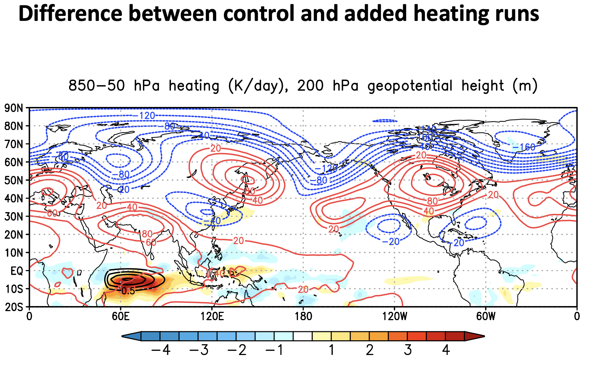

## What am I expected to do?

### Perform the added heating experiment

The instructions are [here](https://cristianastan2.github.io/AOES-CLIM670-CESM-InterventionExp/01-AddedHeating-Exps/index.html)

### Perform the control experiment

Following a similar procedure as the added heating experiment, perform the control experiment.

A control expeirment means that everything is exactly the same except the thing you changed, in this case, the added heating.  This means the two can be cleanly compared to see the impact of added heating.

Use the script called `addheat.control.csh` located in `~cstan/scripts`.

### Make a plot showing the impact of the added heating 

The plot should show the same information as the one Dr. Swenson showed us.

#### Handling the output

You will nead to use the history files, not postprocessed time series files for this. The postprocessing only handles monthly data and requires full years to be complete. The heating output is 6 hourly located in the `h2` history files and the dynamical variables (e.g. U,V,Z) are daily and are located in the `h1` history files. 

As an example, I provide code for reading the `h1` history files from my added heating experiment below:

~~~
path='/glade/scratch/cstan/archive/'
exp_ah='addheat4'
fstub_h1='.cam.h1.*.nc'

ds_ah_h1=xr.open_mfdataset(path+exp_ah+'/atm/hist/'+exp_ah+fstub_h1,
                          combine='nested',concat_dim='time')
~~~
{: .language-python}

### What to plot

Make a plot consistent with Dr. Swenson plot. His plot shows the difference between added heating and control averaged over the 3-months of the run for total heating (filled contours), added heating (black contours) and 200 hPa geopotential height as a representation of the changes in the storm track (blue and red contours).  Below are some hints on how to get and calculate these 3 quanitites from the model output.

#### Heating Differences

To calculate the total heating averaged from 850hPa to 50hPa for the added heating experiment.

1. Get the total heating by adding the heating variables together.  These variables are `QRS`, `QRL`,`DTCOND`, `DTV`, and `Nudge_T`.  
2. Select the 850hPa to 50hPa levels and average over those levels.
3. Calculate the mean over the 3-months of the experiment by averaging the data in time.

Do the same for the control experiment, noting that `Nudge_T` (the added heating) does not exist in the control experiment.

Now, calculate the difference between the two experiments as Added Heating minus control.

Check your units and convert them to K/day

#### 200 hPa Geopotential Height Differences

To calculate the differences in the 200 hPa geopotential height between the two experiments, 

1. Use the `Z3` variable for Geopotential Height
2. Select the lev=200
3. Take the average over the 3-months
4. Difference the two experiments as added heating minus control

#### Added heating 

From the added heating experiment only, calculate the 850hPa-50hPa average of the `Nudge_T` variable and average over the 3-months of the experiment. 

### How to turn it in?

Upload your figure to BB.
 
Make sure it is properly labelled (units, lats/lons, contours, title) and is a `single` figure (this will involve using `contourf` once and `contour` twice (maybe more times if you are matching Dr. Swenson's colors exactly).

### When is it Due?

April 24
